# 

# MANUAL DE USUARIO
### Sistema de Gestión de Inventario, Elaboración y Ventas "Esencap"  

---

## Tabla de Contenidos
1. [Requisitos del Sistema](#1-requisitos-del-sistema)
2. [Inicio de Sesión (Acceso al Sistema)](#2-inicio-de-sesión-acceso-al-sistema)
3. [Explicación del Menú Principal (Dashboard)](#3-explicación-del-menú-principal-dashboard)
4. [Gestión de Insumos (Materias Primas)](#4-gestión-de-insumos-materias-primas)
   - [4.1 Estante de Insumos](#41-estante-de-insumos)
   - [4.2 Crear un Nuevo Insumo](#42-crear-un-nuevo-insumo)
   - [4.3 Editar Datos de Insumo](#43-editar-datos-de-insumo)
   - [4.4 Reponer Stock (Nuevo Lote)](#44-reponer-stock-nuevo-lote)
   - [4.5 Ver y Eliminar Lotes](#45-ver-y-eliminar-lotes)
   - [4.6 Historial Completo de Insumos](#46-historial-completo-de-insumos)
   - [4.7 Insumos Eliminados (Papelera)](#47-insumos-eliminados-papelera)
5. [Gestión de Productos Terminados](#5-gestión-de-productos-terminados)
   - [5.1 Estante de Productos](#51-estante-de-productos)
   - [5.2 Crear un Nuevo Producto (y su Fórmula)](#52-crear-un-nuevo-producto-y-su-fórmula)
   - [5.3 Editar Datos de Producto](#53-editar-datos-de-producto)
   - [5.4 Reponer Stock (Elaborar/Producir)](#54-reponer-stock-elaborarproducir)
   - [5.5 Ver Lotes de Productos](#55-ver-lotes-de-productos)
   - [5.6 Historial de Elaboraciones](#56-historial-de-elaboraciones)
   - [5.7 Productos Eliminados (Papelera)](#57-productos-eliminados-papelera)
6. [Gestión de Usuarios y Ajustes](#6-gestión-de-usuarios-y-ajustes)
   - [6.1 Perfil de Usuario](#61-perfil-de-usuario)
   - [6.2 Registro de Nuevo Usuario](#62-registro-de-nuevo-usuario)
   - [6.3 Cerrar Sesión](#63-cerrar-sesión)
7. [Módulo de Ventas](#7-módulo-de-ventas)
   - [7.1 Registrar Venta (Carrito de Compras)](#71-registrar-venta-carrito-de-compras)
   - [7.2 Historial y Detalle de Ventas](#72-historial-y-detalle-de-ventas)

---

## 1. Requisitos del Sistema

Para garantizar el correcto funcionamiento del sistema **Esencap** y todas sus funcionalidades interactivas, la computadora cliente debe cumplir con los siguientes requerimientos:

### Requisitos de Navegación
* **Navegador Web:** Google Chrome, Mozilla Firefox, Microsoft Edge o Apple Safari en sus versiones más recientes.

### Requisitos de Servidor (Solo Desarrolladores/TI)
Si requiere levantar la aplicación en un nuevo entorno:
* **PHP:** Versión 8.2 o superior.
* **Base de Datos:** MySQL 8.0 o MariaDB equivalente.
* **Gestor de Dependencias:** Composer (PHP) y NPM (Node.js) para la compilación de la interfaz mediante Vite.

---

## 2. Inicio de Sesión (Acceso al Sistema)

El sistema cuenta con un control de accesos estricto para proteger la información confidencial de inventario y ventas. Solo los usuarios autorizados con una cuenta registrada pueden acceder al panel de control.

### Pasos para Ingresar:
1. Abra el navegador web e ingrese a la dirección local del sistema (por defecto: `http://localhost:8000/login`).
2. Se le presentará la pantalla de **Inicio de Sesión** con el logo de **ESENCAP**.
3. Complete los campos requeridos:
   * **Email (Correo Electrónico):** Ingrese su correo electrónico de usuario (ejemplo: `admin@gmail.com`).
   * **Contraseña:** Ingrese su contraseña de acceso seguro (ejemplo: `admin123`).
4. Seleccione la casilla **"Recordarme"** si desea mantener su sesión activa de forma prolongada.
5. Haga clic en el botón verde **"Ingresar"** para acceder al sistema.

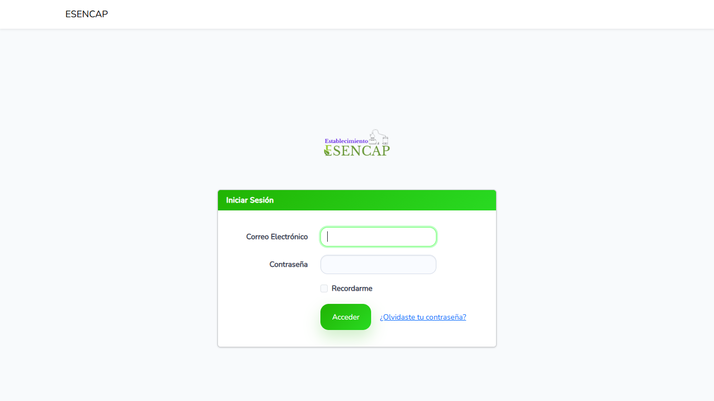

---

## 3. Explicación del Menú Principal (Dashboard)

Una vez ingresado, el sistema lo dirigirá al **Inicio** (Dashboard), el cual ha sido diseñado para ofrecerle un resumen visual y de alto impacto sobre el estado actual de su laboratorio e inventario.

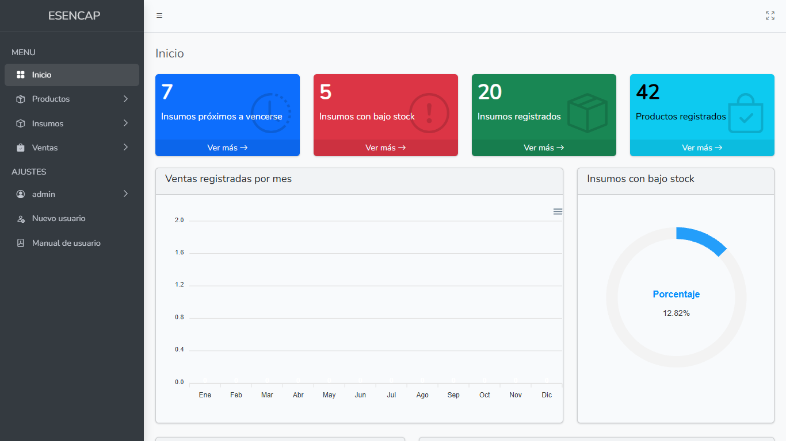

### Tarjetas de Estado (Cajas de Control Rápido):
Al inicio del panel se muestran 4 indicadores clave con información en tiempo real:
* **Insumos próximos a vencerse (Azul):** Muestra cuántos lotes de materias primas tienen una fecha de caducidad cercana (menos de 30 días o ya vencidos). Al hacer clic en **"Ver más"**, el sistema lo redirigirá al panel detallado de vencimientos.
* **Insumos con bajo stock (Rojo):** Advierte sobre insumos cuyas existencias totales son inferiores al punto de equilibrio requerido. Al hacer clic en **"Ver más"**, podrá verificar qué materias primas requieren compras urgentes.
* **Insumos registrados (Verde):** Muestra la cantidad total de insumos distintos que existen cargados en la base de datos de la empresa.
* **Productos registrados (Celeste):** Muestra el total de productos finales diseñados en el sistema listos para ser comercializados.

### Gráficos Analíticos e Interactivos:
* **Ventas registradas por mes (Gráfico de Barras):** Le permite evaluar la evolución comercial a lo largo del año. Al pasar el cursor por encima de una barra, verá la cantidad de ventas concretadas en ese mes.
* **Insumos con bajo stock (Gráfico Radial):** Muestra en formato circular y porcentual el estado general de su abastecimiento de insumos.
* **Productos más vendidos (Gráfico de Torta):** Le indica qué productos representan la mayor cantidad de ventas acumuladas de la empresa, facilitando decisiones sobre qué mercancía conviene fabricar en mayor cantidad.
* **Cantidad de productos vendidos por día (Gráfico de Líneas):** Registra el flujo diario de productos despachados, permitiendo identificar picos de demanda según el día del mes.

---

## 4. Gestión de Insumos (Materias Primas)

Los insumos son los componentes y materias primas requeridos en el laboratorio para fabricar los productos finales.

### 4.1 Estante de Insumos
Para ver el inventario físico, haga clic en **Insumos -> Estante** en el menú lateral.

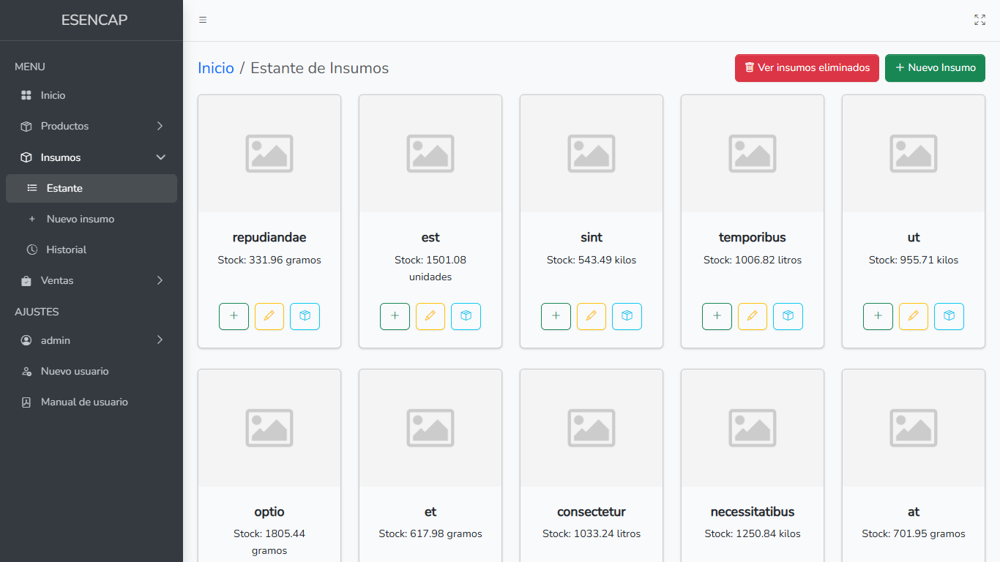

* Esta pantalla funciona como un catálogo visual. Cada insumo se presenta dentro de una tarjeta con su foto, nombre y la suma total de existencias actuales disponibles (indicando su correspondiente unidad de medida, por ejemplo: `1500 gramos` o `12 unidades`).
* **Acciones rápidas desde la tarjeta:**
  * **Botón Verde (+):** Repone stock (añade un nuevo lote).
  * **Botón Amarillo (Lápiz):** Edita los datos básicos.
  * **Botón Celeste (Caja):** Ver los lotes específicos de este insumo.
* En la cabecera, cuenta con accesos directos para **"Nuevo Insumo"** (verde) y **"Ver insumos eliminados"** (rojo, papelera).

---

### 4.2 Crear un Nuevo Insumo
Para registrar un nuevo insumo en el sistema:
1. Diríjase a **Insumos -> Nuevo insumo** en el menú o haga clic en el botón verde del estante.
2. Complete el formulario dividido en dos columnas:
   * **Nombre:** El nombre identificativo de la materia prima (ejemplo: *Repelente*).
   * **Stock inicial:** Ingrese la cantidad física con la que cuenta en este momento y seleccione su unidad de medida del menú desplegable: **gramos**, **unidades**, **kilos** o **litros**.
   * **Familia (Categoría):** Agrupe el insumo en una categoría. 
     > [!TIP]
     > Si la familia del insumo no existe en el listado, haga clic en el botón azul **(+)** al lado de la selección. Se abrirá una ventana emergente donde podrá escribir el nombre de la nueva familia (ejemplo: *Conservantes*) y guardarla al instante sin salir de la página de creación.
   * **Fase:** Clasificación del insumo según su momento de uso en laboratorio: **Acuosa**, **Oleosa** o **Activos**.
   * **Fecha de compra:** Indique en el selector la fecha en que se adquirió este insumo.
   * **Fecha de vencimiento:** Indique la fecha límite de consumo recomendada.
   * **Foto:** Arrastre una imagen o haga clic en el recuadro gris para subir una foto de la materia prima.
3. Presione el botón verde **"Guardar"** en la parte inferior para guardar el insumo. El sistema creará de forma automática el primer lote (Lote N° 1) del insumo con los datos ingresados.

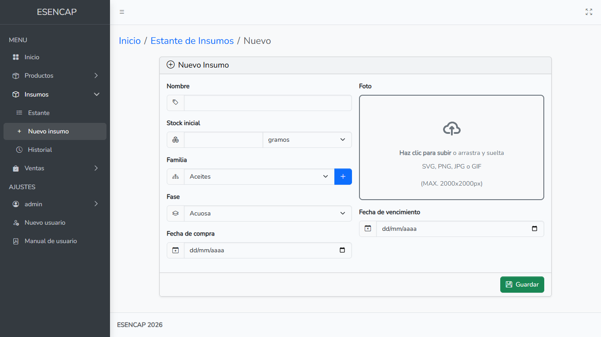

---

### 4.3 Editar Datos de Insumo
Si un insumo cambia de nombre, imagen o desea ajustar su fase:
1. Haga clic en el botón naranja (Lápiz) en la tarjeta del insumo en el Estante.
2. Edite los campos habilitados.
3. **Regla de Protección de Fórmulas:**  
   > [!WARNING]
   > Si el insumo ya ha sido seleccionado en la fórmula de preparación de algún producto terminado, el selector de **Familia** aparecerá bloqueado (color gris y de solo lectura). Esto es una medida de seguridad estricta para evitar que un cambio de categoría altere las proporciones históricas o invalide las recetas preestablecidas en el laboratorio.
4. Para guardar cambios, presione el botón verde **"Guardar"**.
5. **Eliminar Insumo:** Si el insumo ya no se utilizará, presione el botón rojo **"Eliminar"**. Una alerta le solicitará confirmar la acción. Si acepta, el insumo se ocultará del estante mediante una eliminación lógica, sin borrar sus datos históricos de producción.

---

### 4.4 Reponer Stock (Nuevo Lote)
Al comprar más cantidad de un insumo existente, debe ingresar un nuevo lote de compra para mantener la trazabilidad de vencimientos:
1. En el Estante de Insumos, haga clic en el botón verde **(+)** o en **"Reponer stock"** dentro del detalle de lotes.
2. Complete la información requerida:
   * **Número de Lote:** Campo automático que calcula correlativamente el siguiente número de lote (ejemplo: Lote N° 2, 3, etc.).
   * **Stock inicial:** Cantidad que ingresa al depósito.
   * **Fecha de compra:** Fecha de adquisición de este lote.
   * **Fecha de vencimiento:** Fecha de caducidad específica de este lote (fundamental para el control de alertas del inicio).
3. Haga clic en **"Guardar"**. Las unidades se sumarán de inmediato al stock total del insumo.

---

### 4.5 Ver y Eliminar Lotes
Cada lote representa una compra de materia prima con su propia fecha de vencimiento. Para gestionarlos:
1. En la tarjeta del insumo, haga clic en el botón celeste (Caja) **"Ver Lotes"**.
2. Verá un resumen superior de **Lotes registrados** y el **Stock total** de todas las compras vigentes.
3. En la tabla se listan los lotes con la siguiente información:
   * **N° de Lote:** Código de identificación único.
   * **Stock inicial** y **Stock actual** (se reduce a medida que se usa en producción).
   * **F. compra** y **F. vencimiento** (formato dd/mm/yyyy).
4. **Semáforo Visual de Vencimientos:**  
   La fecha de vencimiento de cada lote tiene un color de fondo dinámico para una lectura rápida:
   * **Verde (Seguro):** El lote cuenta con más de 30 días de vigencia antes de caducar.
   * **Amarillo (Alerta):** El lote expira en menos de 30 días. Conviene consumirlo con prioridad.
   * **Rojo (Crítico/Vencido):** El lote ya ha superado la fecha de caducidad.
5. **Eliminar un Lote:** Si un lote se ha dañado o vencido y debe ser descartado, haga clic en el botón rojo de papelera al final de su fila. El lote se removerá del stock activo de forma segura.

---

### 4.6 Historial Completo de Insumos
Para una auditoría o búsqueda avanzada de sus compras de materias primas:
1. Diríjase a **Insumos -> Historial** en el menú.
2. Utilice el panel superior de **Filtros** para afinar sus búsquedas:
   * **Insumo:** Busque por nombre específico.
   * **Fecha de compra:** Filtre lotes ingresados en un día exacto.
   * **Fecha de vencimiento:** Busque lotes que caduquen en una fecha dada.
   * **Estado:** Seleccione si desea ver lotes **Activos** o aquellos que fueron **Eliminados** del depósito.
3. Haga clic en **"Buscar"** para filtrar o en **"Limpiar"** para restaurar el listado original.
4. Puede hacer clic en el encabezado de las columnas (Compra, Insumo, Stock inicial, Stock actual o Vencimiento) para **ordenar los datos de forma ascendente o descendente** con un solo clic.

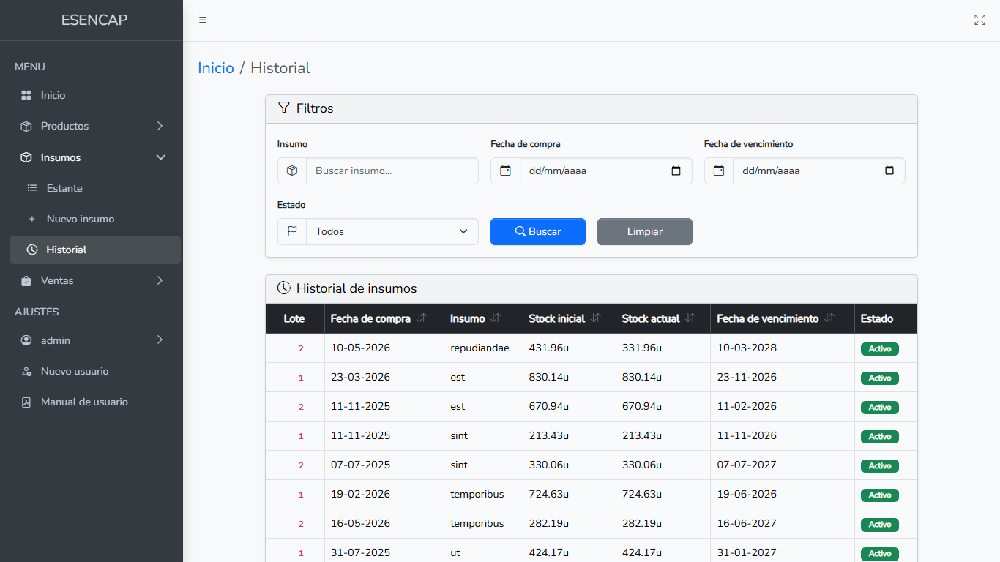

---

### 4.7 Insumos Eliminados (Papelera)
Si eliminó un insumo por error, puede recuperarlo con todos sus lotes históricos:
1. Vaya a **Insumos -> Estante** y presione el botón rojo superior **"Ver insumos eliminados"**.
2. Verá las tarjetas de los insumos que han sido borrados temporalmente.
3. Presione el botón de retorno amarillo **"Restaurar"** (flecha circular).
4. El insumo volverá a estar disponible de forma inmediata en el Estante principal del sistema.

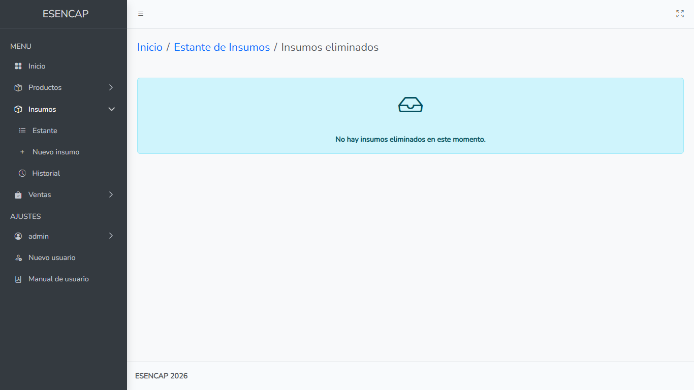

---

## 5. Gestión de Productos Terminados

Los productos son los artículos terminados fabricados en el laboratorio listos para la venta al público.

### 5.1 Estante de Productos
* Acceda desde **Productos -> Estante**. Muestra los productos en tarjetas con su fotografía, nombre y cantidad total de unidades (`u.`) en stock listas para la venta.

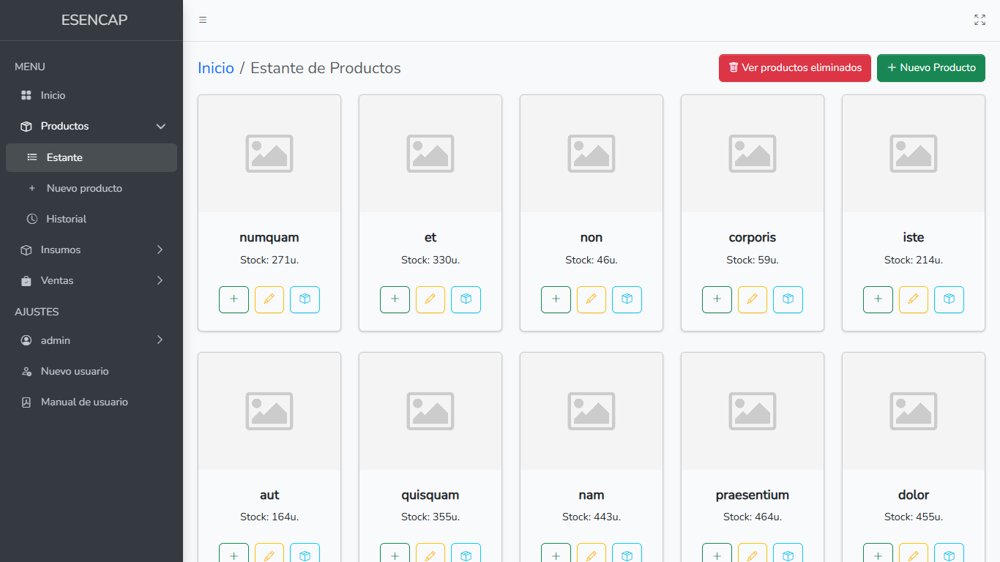

* **Acciones rápidas:**
  * **Botón Verde (+): Reponer Stock (Elaborar/Producir):** Procesa la fabricación de un nuevo lote descontando ingredientes automáticamente.
  * **Botón Amarillo (Lápiz): Editar:** Cambia nombre, imagen o da de baja el producto.
  * **Botón Celeste (Caja): Ver Lotes:** Muestra las producciones históricas individuales de este producto.

---

### 5.2 Crear un Nuevo Producto (y su Fórmula)
El registro de un nuevo producto requiere definir su **Fórmula** o receta de preparación. Esto asegura que la fabricación posterior sea exacta e inteligente.

#### Pasos para Crear:
1. Vaya a **Productos -> Nuevo producto** o haga clic en el botón verde del estante.
2. Complete la información básica:
   * **Nombre:** Nombre del producto (ejemplo: *Crema Hidratante*).
   * **Stock inicial:** Cantidad de unidades físicas iniciales elaboradas.
   * **Contenido por Unidad (en gramos):** Cuánto pesa o contiene una única unidad del producto (ejemplo: si es un pote de `50 gramos`, ingrese `50`).
   * **Fecha de Elaboración:** Fecha en que se fabrica este primer lote.
   * **Foto:** Suba la imagen del producto terminado.
3. **Configuración de la Fórmula:**  
   Aquí definirá qué porcentaje de cada insumo compone a un producto. El sistema calculará en tiempo real los gramos que se consumirán de cada insumo.
   * En la tabla de fórmulas, haga clic en **"Agregar fórmula"** para insertar un ingrediente.
   * Por cada fila de ingrediente complete:
     1. **Porcentaje (%):** Ingrese la participación porcentual del ingrediente en la mezcla (ejemplo: `20` para un 20%).
     2. **Familia:** Seleccione la categoría del insumo.
     3. **Contenido (gr):** Este campo es de solo lectura y **se calcula automáticamente**. Si definió que el producto contiene `50 gramos` en total, y el ingrediente representa el `20%`, el sistema registrará automáticamente `10 gramos` para esta unidad de producto.
     4. **Insumo:** Seleccione la materia prima específica de su stock. Los insumos se cargan dinámicamente según la familia que seleccionó previamente.
   * **Botón de Papelera (rojo):** Elimina esa fila de ingrediente. 
     > [!IMPORTANT]
     > El sistema exige rigurosamente que la **suma total de los porcentajes ingresados sea exactamente el 100%**. Si la suma da menos (ejemplo: 95%) o más (ejemplo: 102%), el formulario mostrará un error y no le permitirá guardar el producto.

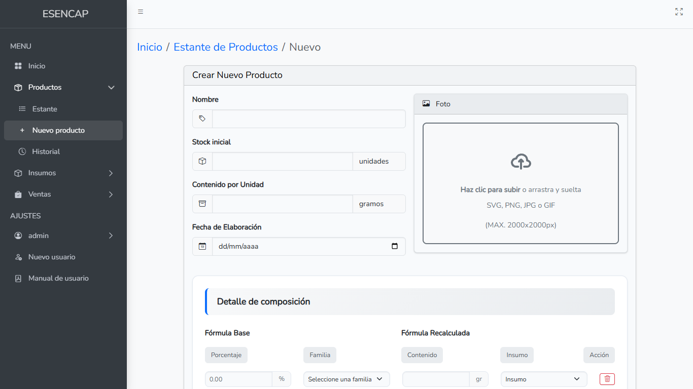

---

### 5.3 Editar Datos de Producto
1. Presione el botón amarillo (Lápiz) en la tarjeta del producto.
2. Podrá editar el **Nombre** del producto y actualizar o eliminar su **Foto**.
3. **Campos Protegidos:**  
   > [!WARNING]
   > Los campos **Stock total** y **Contenido por unidad** aparecen bloqueados. Esto es para preservar la consistencia matemática de los lotes ya elaborados.
4. Guarde cambios con el botón verde o presione **"Eliminar"** si desea enviar el producto a la papelera.
5. También podrá acceder a los lotes desde el botón celeste **"Ver lotes"**

---

### 5.4 Reponer Stock (Elaborar/Producir)
Este módulo será útil cuando produzca una nueva tanda de productos, siga estos pasos:
1. En el estante de productos, haga clic en el botón verde **(+)** o en **"Reponer Stock"** del producto.
2. Indique la cantidad de **Stock inicial** (unidades de producto a fabricar) y la **Fecha de elaboración**.
3. El **Contenido por Unidad** se carga automáticamente, tomando de referencia el valor que se usó cuando se creó el producto por primera vez.
4. **Carga Automática de Fórmula:**  
   El sistema cargará de forma automática los porcentajes e ingredientes que utilizó en la última fabricación del producto, evitándole tener que escribir toda la receta de nuevo. Si requiere hacer algún ajuste en los porcentajes o insumos seleccionados, puede agregarlos o modificarlos libremente.
5. **Descuento Inteligente de Materia Prima:**  
   > [!IMPORTANT]
   > Al hacer clic en **"Guardar"**, el sistema **descontará de forma automática** los gramos del stock actual de las materias primas (comenzando por consumir los lotes de insumos más antiguos primero).
6. **Validación de Stock Insuficiente:**  
   Si en el depósito no cuenta con suficientes gramos disponibles de alguna materia prima para cubrir la producción solicitada, el sistema detendrá el proceso y mostrará una alerta detallada indicándole qué insumo falta y qué cantidad requiere reponer antes de poder fabricar.

---

### 5.5 Ver Lotes de Productos
1. En la tarjeta del producto, haga clic en el botón celeste (Caja) **"Ver Lotes"**.
2. Verá una tabla con todos los lotes producidos:
   * **N° de Lote:** Identificador de la producción.
   * **Fecha de Elaboración:** Fecha en que se elaboró.
   * **Stock inicial** y **Stock actual** de este lote de productos.
   * **Acción (Botón Celeste - Ojo):** Abre una ventana emergente que le muestra la fórmula exacta utilizada para elaborar este lote de productos, indicando los porcentajes y los insumos específicos consumidos.
3. **Eliminar lote:** Puede eliminar el lote con el botón de papelera al final de la fila.

---

### 5.6 Historial de Elaboraciones
* En **Productos -> Historial** accederá al registro general de producción. Muestra en una tabla interactiva todos los lotes fabricados históricamente por la empresa, permitiendo auditar fechas, productos involucrados, cantidades iniciales cargadas y stock actual.
* **Acción (Botón Celeste - Ojo):** Aquí también podrá ver la fórmula exacta utilizada para elaborar este lote de productos, indicando los porcentajes y los insumos específicos consumidos.

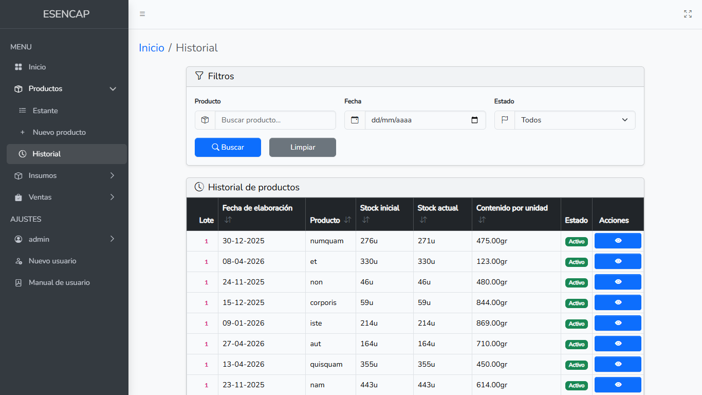

---

### 5.7 Productos Eliminados (Papelera)
* Presione **"Ver productos eliminados"** en la parte superior del estante. Verá las fichas de los productos borrados. Puede presionar el botón de flecha circular **"Restaurar"** para reactivarlos.

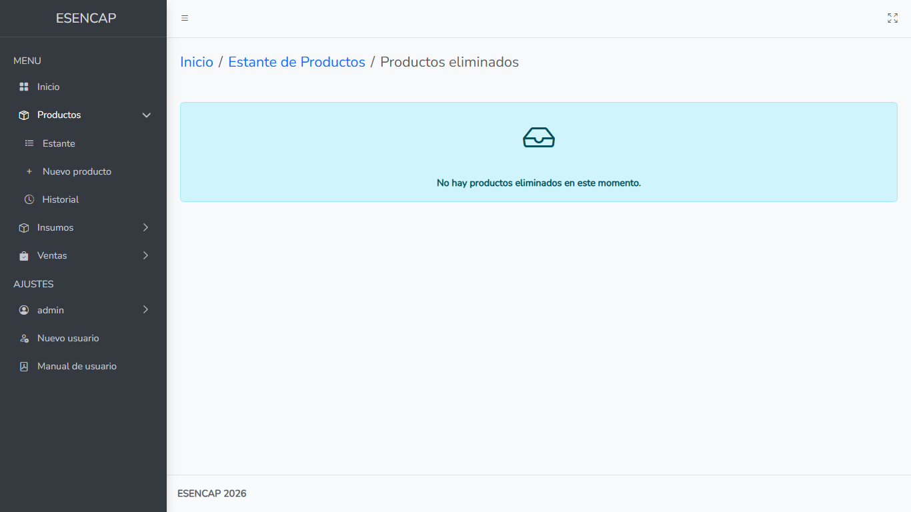

---

## 6. Gestión de Usuarios y Ajustes

El sistema permite la administración de las cuentas autorizadas para interactuar con la plataforma.

### 6.1 Perfil de Usuario
Para actualizar sus propios accesos:
1. Diríjase a **Ajustes -> [Su Nombre] -> Perfil** en el menú de navegación lateral.
2. Se presentará el formulario dividido en dos áreas:
   * **Información de la cuenta:** Modifique su **Nombre de usuario** e **Email**. La fecha de creación e historial de modificaciones son de solo lectura.
   * **Cambiar contraseña:** Ingrese su **Contraseña actual**, defina su **Nueva contraseña** y confírmela en el tercer recuadro.
3. Haga clic en el botón verde **"Guardar cambios"** en la parte inferior. El sistema le notificará que sus accesos fueron modificados exitosamente.

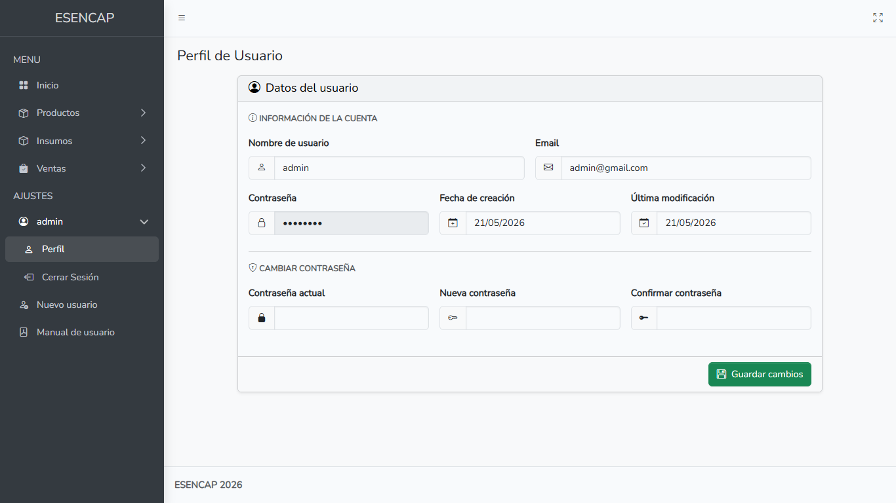

---

### 6.2 Registro de Nuevo Usuario
Si desea registrar a un nuevo usuario en el sistema:
1. En el menú lateral haga clic en la opción **"Nuevo usuario"** (acompañado de un ícono de usuario con el símbolo +).
2. Complete la ficha del nuevo colaborador: nombre, dirección de correo electrónico y contraseña de acceso.
3. Guarde el registro. A partir de ese momento, el nuevo usuario podrá iniciar sesión con sus credenciales propias.

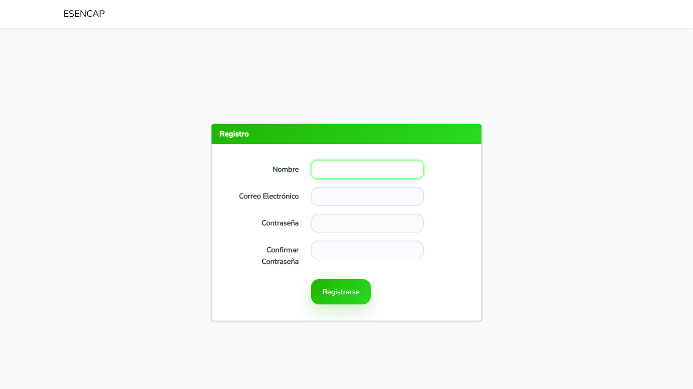

---

### 6.3 Cerrar Sesión
Para cerrar la sesión actual:
1. Haga clic sobre su nombre en el menú lateral bajo el área de **Ajustes**.
2. Seleccione la opción **"Cerrar Sesión"**.
3. El sistema lo devolverá a la pantalla de Iniciar Sesión.

---

## 7. Módulo de Ventas

El sistema cuenta con un registro de ventas que interactúa de forma directa con el inventario de productos elaborados.

### 7.1 Registrar Venta (Carrito de Compras)
Para registrar una venta a un cliente:
1. Vaya al menú lateral y seleccione **Ventas -> Registrar venta**.
2. **Cabecera de la Transacción:**
   * **Cliente:** Ingrese el nombre del comprador o cliente.
   * **Fecha:** Indique la fecha en que se realiza la venta.
3. **Agregar Productos al Carrito:**
   * En el panel gris **"Agregar Productos"**, comience a escribir las primeras letras del producto en el buscador **"Producto"**.
   * **Autocompletado Inteligente:** El sistema desplegará de inmediato una lista con los productos que coinciden con su búsqueda. Seleccione el producto deseado con el cursor.
   * Ingrese la **Cantidad** de unidades a vender.
   * Haga clic en el botón azul **"Agregar al Carrito"**.
4. **Visualización y Ajuste en Carrito:**
   * El producto aparecerá en la lista de compras inferior.
   * Puede **ajustar la cantidad de unidades directamente en la tabla** modificando el número en el casillero.
   * Si desea descartar un producto agregado al carrito, haga clic en el botón rojo de papelera al final de su fila.
5. **Cálculo y Validación de Stock en Ventas:**
   * El sistema validará automáticamente si la cantidad que desea vender de cada producto está disponible en su inventario.
6. **Registrar Venta:**
   * Cuando el carrito esté listo, haga clic en el botón verde **"Registrar Venta"**.
   * El sistema procesará el pedido y **descontará automáticamente el stock del producto** vendido (despachando en primer lugar los lotes de elaboración más antiguos).

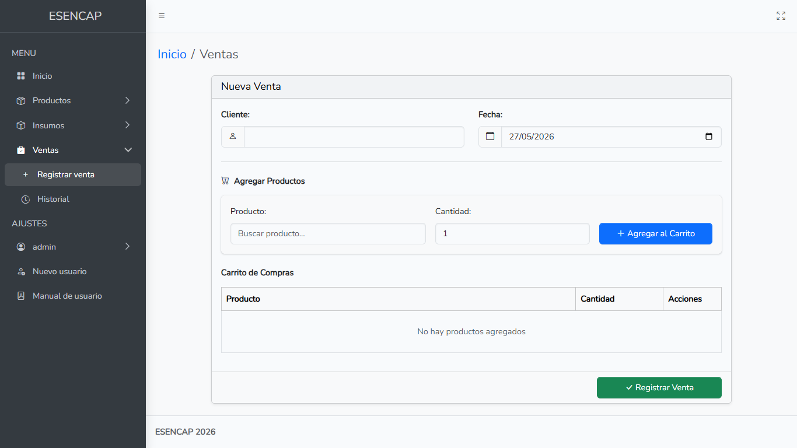

---

### 7.2 Historial y Detalle de Ventas
Para auditar las operaciones comerciales de la empresa:
1. Vaya a **Ventas -> Historial** en el menú.
2. Filtre la información utilizando el buscador superior por **Cliente** o indicando una **Fecha** de venta específica.
3. En la tabla se listan las transacciones concretadas con la fecha de operación y el nombre del cliente.
4. **Ver Detalle de Factura (Modal Flotante):**
   * Presione el botón celeste **"Ver"** al final de la fila de una venta.
   * Se abrirá una ventana emergente interactiva de color verde claro que detalla:
     * N° de Venta, Nombre del Cliente y Fecha de la operación.
     * **Productos vendidos:** Listado de los productos con sus respectivas cantidades adquiridas.
     * **Total de unidades:** Suma consolidada de la cantidad total de artículos despachados en esa venta específica.
   * Presione el botón rojo **"Cerrar"** para regresar a la vista del historial.

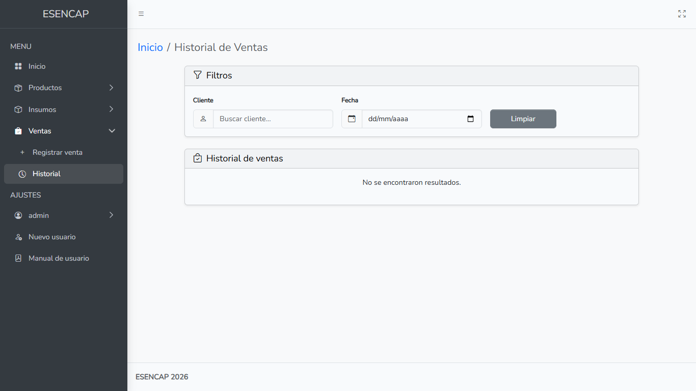
